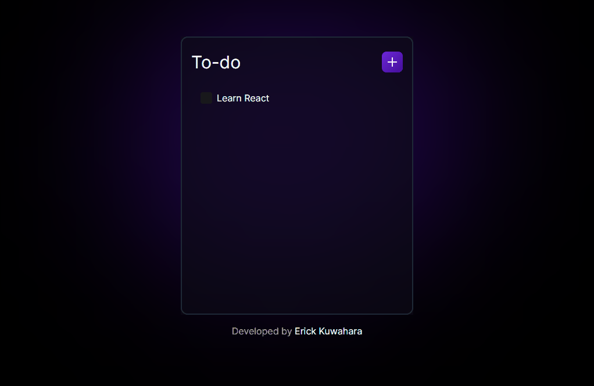

    <h2>⚜️&nbsp; T O D O &nbsp; L I S T &nbsp;⚜️</h2>

    <a href="#-project">Project</a>&nbsp;&nbsp;&nbsp;|&nbsp;&nbsp;&nbsp;
    <a href="#-technologies">Technologies</a>&nbsp;&nbsp;&nbsp;|&nbsp;&nbsp;&nbsp;
    <a href="#-features">Features</a>

 

<h3 align="center">
    
     
    <a href="https://erickks.github.io/to-do-list-react/">live demo</a>
</h3>

## 📚 Project

This is a straightforward task management application, built with React and TypeScript, that enables users to create, manage, and keep track of their daily tasks.

With a user-friendly and intuitive interface, you can add tasks, mark them as completed, and delete them as needed.

 

## 🖥 Technologies

- [React](https://reactjs.org/)
- [TypeScript](https://www.typescriptlang.org/)
- [Tailwindcss](https://tailwindcss.com/)
- [Radix UI](https://www.radix-ui.com/)
- [Lucide Icons](https://lucide.dev)

 

## 🧾 Features

- [x] Add a new task
- [x] Delete a task
- [x] Mark the task as complete or incomplete
- [x] Accessible components
- [x] Prevention of adding empty tasks
- [x] Design responsive
