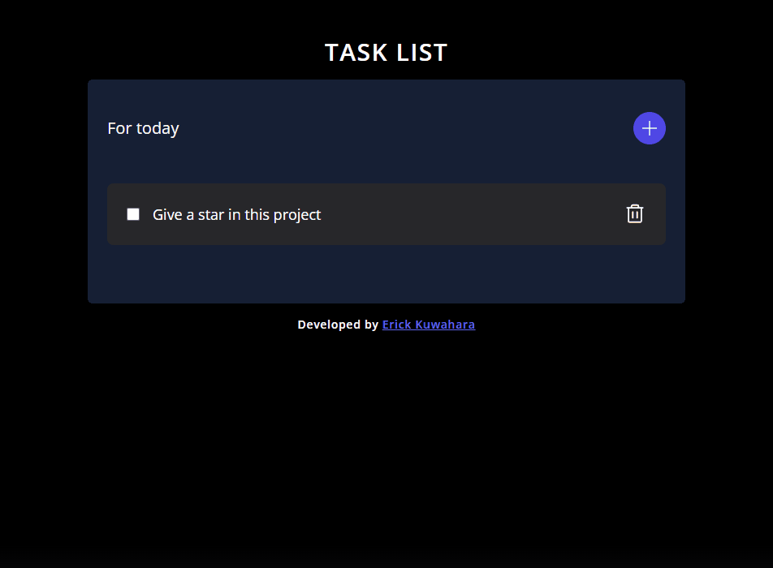

    <h2>⚜️&nbsp; T O D O &nbsp; L I S T &nbsp;⚜️</h2>

    <a href="#-project">Project</a>&nbsp;&nbsp;&nbsp;|&nbsp;&nbsp;&nbsp;
    <a href="#-technologies">Technologies</a>&nbsp;&nbsp;&nbsp;|&nbsp;&nbsp;&nbsp;
    <a href="#-features">Features</a>

 

<h3 align="center">
    
     
    <a href="https://erickks.github.io/to-do-list-react/">live demo</a>
</h3>

## 📚 Project

After a long time, I finally decided to create a to-do list. It is simple but functional and fully accessible.

This is my first project using React and TypeScript so it might have some errors which I haven't seen yet. As I learn more, I'll try to update this project for better performance.

 

## 🖥 Technologies
  * [Html](https://www.w3schools.com/html/)
  * [Tailwindcss](https://tailwindcss.com/)
  * [React](https://reactjs.org/)
  * [TypeScript](https://www.typescriptlang.org/)
  * [Radix](https://www.radix-ui.com/)
  * [PhosphorIcons](https://phosphoricons.com/)
 

## 🧾 Features
- [x] Add a new task
- [x] Mark the task as complete or not
- [x] Delete a task
- [x] Accessible components
- [x] Prevention against adding empty tasks
- [x] Design responsive
